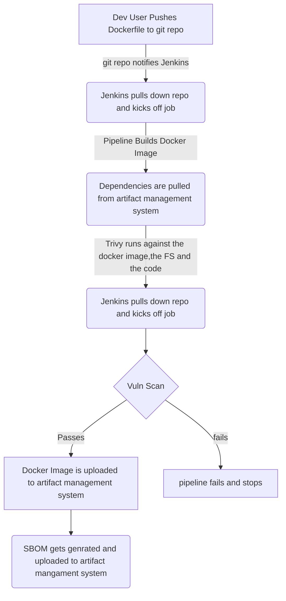

This is to go over a container image pipeline that will scan for vulnerabilities and generate a Software Bill of Materials at the end.

# Proposed Architecture


# Trivy
## What is Trivy?
Trivy (tri pronounced like trigger, vy pronounced like envy) is a simple and comprehensive scanner for vulnerabilities in container images, file systems, and Git repositories, as well as for configuration issues. Trivy detects vulnerabilities of OS packages (Alpine, RHEL, CentOS, etc.) and language-specific packages (Bundler, Composer, npm, yarn, etc.). In addition, Trivy scans Infrastructure as Code (IaC) files such as Terraform, Dockerfile and Kubernetes, to detect potential configuration issues that expose your deployments to the risk of attack. Trivy also scans hardcoded secrets like passwords, API keys and tokens. Trivy is easy to use. Just install the binary and you're ready to scan.


## Features
- Comprehensive vulnerability detection
  - OS packages (Alpine Linux, Red Hat Universal Base Image, Red Hat Enterprise Linux, CentOS, AlmaLinux, Rocky Linux, CBL-Mariner, Oracle Linux, Debian, Ubuntu, Amazon Linux, openSUSE Leap, SUSE Enterprise Linux, Photon OS and Distroless)
- Language-specific packages (Bundler, Composer, Pipenv, Poetry, npm, yarn, Cargo, NuGet, Maven, and Go)
Misconfiguration detection (IaC scanning)
  - A wide variety of built-in policies are provided out of the box
    - Kubernetes, Docker, Terraform, and more coming soon
  - Support custom policies
- Secret detection
  - A wide variety of built-in rules are provided out of the box
  - Support custom rules
  - Scan container images at a high speed
- Simple
  - Specify only an image name, a path to config files, or an artifact name
- Fast
  - The first scan will finish within 10 seconds (depending on your network). Consequent scans will finish in a single second.
- Easy installation
  - apt-get install, yum install and brew install are possible.
  - No pre-requisites such as installation of DB, libraries, etc.
- High accuracy
  - Especially [Alpine Linux](https://ariadne.space/2021/06/08/the-vulnerability-remediation-lifecycle-of-alpine-containers/) and RHEL/CentOS
  - Other OSes are also high
- DevSecOps
  - Suitable for CI such as GitHub Actions, Jenkins, GitLab CI, etc.
- Support multiple targets
  - container image, local filesystem, and remote git repository
- Supply chain security (SBOM support)
  - Support CycloneDX
  - Support SPDX

## Integrations
VSCode via an extension -https://github.com/aquasecurity/trivy-vscode-extension

Docker Dekstop via an extension - https://github.com/aquasecurity/trivy-docker-extension#:~:text=Trivy%20Docker%20Extension-,What%20is%20this%3F,image%20into%20the%20drop%20down

## SBOM's
Trivy can create a Software Bill of Materials!
### For Containers:
```bash
>$ trivy sbom <imagename>
```
### For Filesystems:
```bash
>$ trivy sbom --artifact-type fs ./
```
### For Git Repos:
```bash
>$ trivy sbom --artifact-type repo <repo>
```
## Where does Trivy get its data sources from?
Data sources official doc: https://aquasecurity.github.io/trivy/v0.28.1/docs/vulnerability/detection/data-source/

# OS

| OS             | Source                                                                              |
| ---------------| ---------------------------------------- |
| Arch Linux     | [Vulnerable Issues][arch]                |
| Alpine Linux   | [secdb][alpine]                          |
| Amazon Linux 1 | [Amazon Linux Security Center][amazon1]  |
| Amazon Linux 2 | [Amazon Linux Security Center][amazon2]  |
| Debian         | [Security Bug Tracker][debian-tracker]   |
|                | [OVAL][debian-oval]                      |
| Ubuntu         | [Ubuntu CVE Tracker][ubuntu]             |
| RHEL/CentOS    | [OVAL][rhel-oval]                        |
|                | [Security Data][rhel-api]                |
| AlmaLinux      | [AlmaLinux Product Errata][alma]         |
| Rocky Linux    | [Rocky Linux UpdateInfo][rocky]          |
| Oracle Linux   | [OVAL][oracle]                           |
| CBL-Mariner    | [OVAL][mariner]                          |
| OpenSUSE/SLES	 | [CVRF][suse]                             |
| Photon OS      | [Photon Security Advisory][photon]       |

# Programming Language

| Language                     | Source                                              | Commercial Use  | Delay[^1]|
| ---------------------------- | ----------------------------------------------------|:---------------:|:--------:|
| PHP                          | [PHP Security Advisories Database][php]             | ✅              | -        |
|                              | [GitHub Advisory Database (Composer)][php-ghsa]     | ✅              | -        |
| Python                       | [GitHub Advisory Database (pip)][python-ghsa]       | ✅              | -        |
|                              | [Open Source Vulnerabilities (PyPI)][python-osv]    | ✅              | -        |
| Ruby                         | [Ruby Advisory Database][ruby]                      | ✅              | -        |
|                              | [GitHub Advisory Database (RubyGems)][ruby-ghsa]    | ✅              | -        |
| Node.js                      | [Ecosystem Security Working Group][nodejs]          | ✅              | -        |
|                              | [GitHub Advisory Database (npm)][nodejs-ghsa]       | ✅              | -        |
| Java                         | [GitLab Advisories Community][gitlab]               | ✅              | 1 month  |
|                              | [GitHub Advisory Database (Maven)][java-ghsa]       | ✅              | -        |
| Go                           | [GitLab Advisories Community][gitlab]               | ✅              | 1 month  |
|                              | [The Go Vulnerability Database][go]                 | ✅              | -        |
| Rust                         | [Open Source Vulnerabilities (crates.io)][rust-osv] | ✅              | -        |
| .NET                         | [GitHub Advisory Database (NuGet)][dotnet-ghsa]     | ✅              | -        |

[^1]: Intentional delay between vulnerability disclosure and registration in the DB

# Others

| Name                            | Source     |  
| --------------------------------|------------|
| National Vulnerability Database | [NVD][nvd] | 

# Data source selection
Trivy **only** consumes security advisories from the sources listed in the following tables.

As for packages installed from OS package managers (`dpkg`, `yum`, `apk`, etc.), Trivy uses the advisory database from the appropriate **OS vendor**.

For example: for a python package installed from `yum` (Amazon linux), Trivy will only get advisories from [ALAS][amazon2]. But for a python package installed from another source (e.g. `pip`), Trivy will get advisories from the `GitLab` and `GitHub` databases.

This advisory selection is essential to avoid getting false positives because OS vendors usually backport upstream fixes, and the fixed version can be different from the upstream fixed version.
The severity is from the selected data source. If the data source does not provide severity, it falls back to NVD, and if NVD does not have severity, it will be UNKNOWN.

[arch]: https://security.archlinux.org/
[alpine]: https://secdb.alpinelinux.org/
[amazon1]: https://alas.aws.amazon.com/
[amazon2]: https://alas.aws.amazon.com/alas2.html
[debian-tracker]: https://security-tracker.debian.org/tracker/
[debian-oval]: https://www.debian.org/security/oval/
[ubuntu]: https://ubuntu.com/security/cve
[rhel-oval]: https://www.redhat.com/security/data/oval/v2/
[rhel-api]: https://www.redhat.com/security/data/metrics/
[alma]: https://errata.almalinux.org/
[rocky]: https://download.rockylinux.org/pub/rocky/
[oracle]: https://linux.oracle.com/security/oval/
[suse]: http://ftp.suse.com/pub/projects/security/cvrf/
[photon]: https://packages.vmware.com/photon/photon_cve_metadata/
[mariner]: https://github.com/microsoft/CBL-MarinerVulnerabilityData/

[php-ghsa]: https://github.com/advisories?query=ecosystem%3Acomposer
[python-ghsa]: https://github.com/advisories?query=ecosystem%3Apip
[ruby-ghsa]: https://github.com/advisories?query=ecosystem%3Arubygems
[nodejs-ghsa]: https://github.com/advisories?query=ecosystem%3Anpm
[java-ghsa]: https://github.com/advisories?query=ecosystem%3Amaven
[dotnet-ghsa]: https://github.com/advisories?query=ecosystem%3Anuget

[php]: https://github.com/FriendsOfPHP/security-advisories
[ruby]: https://github.com/rubysec/ruby-advisory-db
[nodejs]: https://github.com/nodejs/security-wg
[gitlab]: https://gitlab.com/gitlab-org/advisories-community
[go]: https://github.com/golang/vulndb

[python-osv]: https://osv.dev/list?q=&ecosystem=PyPI
[rust-osv]: https://osv.dev/list?q=&ecosystem=crates.io

[nvd]: https://nvd.nist.gov/

## Ari-Gapped Environment
Trivy can be used in air-gapped environments. Note that an allowlist is [here](https://aquasecurity.github.io/trivy/v0.28.1/docs/references/troubleshooting/).
- ghcr.io
- pkg-containers.githubusercontent.com

### Air-Gapped Environment for Vulnerabilities
#### Download the vulnerability database
At first, you need to download the vulnerability database for use in air-gapped environments. Please follow [oras installation instruction](https://oras.land/cli/).

Download db.tar.gz:
```bash
$ oras pull ghcr.io/aquasecurity/trivy-db:2 -a
```
#### Transfer the DB file into the air-gapped environment
The way of transfer depends on the environment.
```bash
$ rsync -av -e ssh /path/to/db.tar.gz [user]@[host]:dst
```
#### Put the DB file in Trivy's cache directory
You have to know where to put the DB file. The following command shows the default cache directory.
```bash
$ ssh user@host
$ trivy -h | grep cache
   --cache-dir value  cache directory (default: "/home/myuser/.cache/trivy") [$TRIVY_CACHE_DIR]
```
Put the DB file in the cache directory + /db.
```bash
$ mkdir -p /home/myuser/.cache/trivy/db
$ cd /home/myuser/.cache/trivy/db
$ tar xvf /path/to/db.tar.gz -C /home/myuser/.cache/trivy/db
x trivy.db
x metadata.json
$ rm /path/to/db.tar.gz
```
In an air-gapped environment, it is your responsibility to update the Trivy database on a regular basis so that the scanner can detect recently-identified vulnerabilities.

#### Run Trivy with --skip-update and --offline-scan option
In an air-gapped environment, specify --skip-update so that Trivy doesn't attempt to download the latest database file. In addition, if you want to scan Java dependencies such as JAR and pom.xml, you need to specify --offline-scan since Trivy tries to issue API requests for scanning Java applications by default.

```bash
$ trivy image --skip-update --offline-scan alpine:3.12
```

### Air-Gapped Environment for misconfigurations
No special measures are required to detect misconfigurations in an air-gapped environment.

#### Run Trivy with --skip-policy-update option
In an air-gapped environment, specify --skip-policy-update so that Trivy doesn't attempt to download the latest misconfiguration policies.
```bash
$ trivy conf --skip-policy-update /path/to/conf
```
## Exceptions / Custom Policies
Exceptions let you specify cases where you allow policy violations. Trivy supports two types of exceptions.
Example:
```bash
package user.kubernetes.ID100

__rego_metadata := {
    "id": "ID100",
    "title": "Deployment not allowed",
    "severity": "HIGH",
    "type": "Kubernetes Custom Check",
}

deny_deployment[msg] {
    input.kind == "Deployment"
    msg = sprintf("Found deployment '%s' but deployments are not allowed", [name])
}

exception[rules] {
    input.kind == "Deployment"
    input.metadata.name == "allow-deployment"

    rules := ["deployment"]
}
```
### Custom Polcies
You can write custom policies in [Rego](https://www.openpolicyagent.org/docs/latest/policy-language/). Once you finish writing custom policies, you can pass the directory where those policies are stored with --policy option.
```bash
trivy conf --policy /path/to/custom_policies --namespaces user /path/to/config_dir
```
#### File formats

| File format   | File pattern                                              |
|---------------|-----------------------------------------------------------|
| JSON          | `*.json`                                                  |
| YAML          | `*.yaml` and `*.yml`                                      |
| Dockerfile    | `Dockerfile`, `Dockerfile.*`, and `*.Dockerfile`          |
| Containerfile | `Containerfile`, `Containerfile.*`, and `*.Containerfile` |
| Terraform     | `*.tf` and `*.tf.json`                                    |

#### Example:
```bash
package user.kubernetes.ID001

__rego_metadata__ := {
    "id": "ID001",
    "title": "Deployment not allowed",
    "severity": "LOW",
    "type": "Custom Kubernetes Check",
    "description": "Deployments are not allowed because of some reasons.",
}

__rego_input__ := {
    "selector": [
        {"type": "kubernetes"},
    ],
}

deny[msg] {
    input.kind == "Deployment"
    msg = sprintf("Found deployment '%s' but deployments are not allowed", [input.metadata.name])
}
```

# Pipeline
## Jenkins Pipeline
We will be using Jenkins as our main orchestrator.
Created my own here: https://github.com/tamalerhino/chubby-unicorn/blob/main/Jenkinsfile
```js
pipeline {
  agent any
  options {
    buildDiscarder(logRotator(numToKeepStr: '5'))
  }
  stages {
    stage('Build') {
      steps {
        sh 'docker build -t "${IMAGENAME}" .'
      }
    }
    stage('Scan') {
      steps {
        sh 'trivy image --exit-code 1 --severity MEDIUM,HIGH,CRITICAL "${IMAGENAME}"'
      }
    }
    
    stage('Create SBOM') {
      steps {
        sh 'trivy --output "${IMAGENAME}".json sbom "${IMAGENAME}"'
      }
    }
    stage('Upload Artifacts') {
      steps {
        sh 'docker login "${CONTAINER-REPO-URL}" -u="${CONTAINER-REPO-USERNAME}" -p="${CONTAINER-REPO-PASSWORD]"'
        sh 'docker tag "${IMAGENAME}" "${CONTAINERPROJECT}"/"${IMAGENAME}"'
        sh 'docker push "${CONTAINER-REPO-URL}"/"${CONTAINERPROJECT}"/"${IMAGENAME}"'
      }
       steps {
        sh 'curl -u "${USERNAME}":"${PASSWORD}" -X PUT  "${ARTIFACTORY-RUL}/"${CONTAINERPROJECT}"/"${IMAGENAME}".json" -T "${IMAGENAME}".json'
      }
    }
  }
}
```
